class: black-slide
background-image: url(figures/title-bg.gif)
background-size: cover

.overlay-box.overlay-title-slide[
.overlay-title[Inverting scientific images with deep generative models]

.title-author[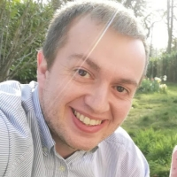.title-author-text[Gilles Louppe .smaller[[g.louppe@uliege.be](mailto:g.louppe@uliege.be)]]]

.title-footer[.smaller[AI4Sci 2026, Mainz October 8, 2026]]
]

???

Thank you for the invitation. It is a pleasure to be here.

This talk is about inverse problems in science, and how diffusion models help us solve them. We will start with a few pictures, and end with the state of the ocean and of the whole atmosphere.

---

class: middle, black-slide, center
background-image: url(figures/title-bg.gif)
background-size: cover

.bold.larger.shadowed[From a noisy observation $y$...]

???

Suppose we observe this. It is a coarse and noisy observation $y$ of a 2D turbulent flow, averaged over large blocks.

---

class: middle, black-slide, center

.bg-video[<video autoplay muted loop playsinline poster="figures/x.png" src="figures/videos/teaser-x.mp4"></video>]

.bold.larger.shadowed[... can we recover   all plausible physical states $x$?]

???

Given $y$, we want to recover all plausible physical states $x$ that could have produced it. Here is one of them, the true flow. Many others are consistent with the same blocks. We want them all, as a distribution.

This toy flow is not an exception. The same question arises whenever an instrument stands between us and the system we study. Let me show you five examples, from molecules to galaxies.

---

class: black-slide
background-image: url(figures/mic-y.png)
background-size: cover

.overlay-box.overlay-intro[
.overlay-title[Cryo-electron microscopy]

Thousands of noisy 2D projections $y$ of a molecule, in unknown orientations.
]

.footnote[Simulated particle images of the .italic[P. falciparum] 80S ribosome (EMD-2660).]

???

First, structural biology. Cryo-electron microscopy images molecules frozen in ice. Each image is a 2D projection of the molecule, seen from an unknown angle, blurred by the microscope and buried in noise. The noise is unavoidable, because a stronger electron beam would destroy the sample. A typical dataset holds hundreds of thousands of such images. This is the observation $y$.

---

class: black-slide
background-image: url(figures/mic-x.png)
background-size: cover

.overlay-box.overlay-intro[
.overlay-title[Cryo-electron microscopy]

The 3D structure $x$ of the molecule.
]

.footnote[Structure: EMD-2660, [Wong et al](https://doi.org/10.7554/eLife.03080), eLife 2014. Flow-prior reconstruction: [Zhou et al](https://arxiv.org/abs/2410.08631), ICLR 2025 (arXiv:2410.08631).]

???

What we want is the molecule behind these images, as shown here in 3D. A ribosome of the malaria parasite, at near-atomic resolution. This is the state $x$. Every detail of it must be inferred from those noisy projections.

---

class: black-slide
background-image: url(figures/mri-y.png)
background-size: cover

.overlay-box.overlay-top-right[
.overlay-title[Accelerated MRI]

Undersampling k-space speeds up the scan but leaves aliased images $y$.
]

.footnote[Credits: [Rozet et al](https://arxiv.org/abs/2405.13712), NeurIPS 2024 (arXiv:2405.13712).]

???

Second, medical imaging. An MRI scan measures the image in Fourier space, line by line. To make scans faster, we measure only some of the lines, here one out of six. A naive reconstruction then gives these blurry, aliased images. This is the observation $y$.

---

class: black-slide
background-image: url(figures/mri-x.png)
background-size: cover

.overlay-box.overlay-top-right[
.overlay-title[Accelerated MRI]

The full-resolution scans $x$.
]

.footnote[Credits: [Rozet et al](https://arxiv.org/abs/2405.13712), NeurIPS 2024 (arXiv:2405.13712).]

???

What we want is the knee behind these images, as shown here at full resolution. This is the state $x$. The missing lines must be filled in, consistently with what a knee looks like.

---

class: black-slide
background-image: url(figures/sat-y.png)
background-size: cover

.overlay-box.overlay-intro-right[
.overlay-title[Earth observation]

Satellites measure infrared radiances $y$, not the state of the atmosphere.
]

.footnote[Data: [GridSat-B1](https://www.ncei.noaa.gov/products/gridded-geostationary-brightness-temperature), NOAA NCEI, infrared brightness temperatures, March 21, 2021, 00:00 UTC.]

???

Third, weather. Satellites do not measure the atmosphere directly. They measure radiation. Here, the infrared radiation seen by the geostationary satellites, at one instant. Cold cloud tops appear white. This is the observation $y$.

---

class: black-slide
background-image: url(figures/sat-x.png)
background-size: cover

.overlay-box.overlay-intro-right[
.overlay-title[Earth observation]

The state $x$ of the atmosphere, here water vapour, wind, temperature and humidity.
]

.footnote[Data: [ERA5](https://doi.org/10.1002/qj.3803) reanalysis, via [WeatherBench 2](https://github.com/google-research/weatherbench2), March 21, 2021, 00:00 UTC.]

???

What we want is the atmosphere behind these measurements, as shown here at that same instant. This is the state $x$, in 3D. We show four of its variables, water vapour, wind, temperature and humidity. Recovering this state from observations is called data assimilation. We will come back to it at the end of the talk.

---

class: black-slide
background-image: url(figures/bh-y.png)
background-size: cover

.overlay-box.overlay-top-left[
.overlay-title[Black hole imaging]

A few radio telescopes across the Earth sample the Fourier transform $y$ of the image.
]

.footnote[Data: [EHT Collaboration](https://github.com/eventhorizontelescope/2019-D01-01), M87*, April 11, 2017.]

???

Fourth, radio astronomy. The Event Horizon Telescope combines radio telescopes all over the Earth, to image the black hole at the center of the galaxy M87. Each pair of telescopes measures one Fourier coefficient of the image. As the Earth rotates, these measurements trace these tracks. This is everything that was measured on one night in April 2017. This is the observation $y$, and most of the plane is empty.

---

class: black-slide
background-image: url(figures/bh-x.png)
background-size: cover

.overlay-box.overlay-top-left[
.overlay-title[Black hole imaging]

Images $x$ of M87*, all consistent with the data.
]

.footnote[Credits: [Wu et al](https://arxiv.org/abs/2405.18782), NeurIPS 2024 (arXiv:2405.18782).]

???

What we want is the image behind these measurements, as shown here. Or rather several images, all consistent with the same measurements. Each one is a possible state $x$. The ring is always there. The fine details are not.

---

class: black-slide
background-image: url(figures/lens-y.png)
background-size: cover

.overlay-box.overlay-intro-right[
.overlay-title[Gravitational lensing]

A foreground galaxy distorts a background galaxy into an Einstein ring $y$.
]

.footnote[Credits: [Adam et al](https://arxiv.org/abs/2211.03812), NeurIPS ML4PS workshop 2022 (arXiv:2211.03812).]

???

Fifth, cosmology. A massive galaxy in the foreground bends the light of a more distant galaxy into a ring, an Einstein ring. This noisy ring is the observation $y$.

---

class: black-slide
background-image: url(figures/lens-x.png)
background-size: cover

.overlay-box.overlay-intro-right[
.overlay-title[Gravitational lensing]

Undistorted images $x$ of the background galaxy, all consistent with the data.
]

.footnote[Credits: [Adam et al](https://arxiv.org/abs/2211.03812), NeurIPS ML4PS workshop 2022 (arXiv:2211.03812).]

???

What we want is the galaxy behind the ring, as shown here without the lens. Several plausible versions of it, each a possible state $x$. Lensed again, each of them reproduces the observed ring.

---

class: middle

.center.width-80[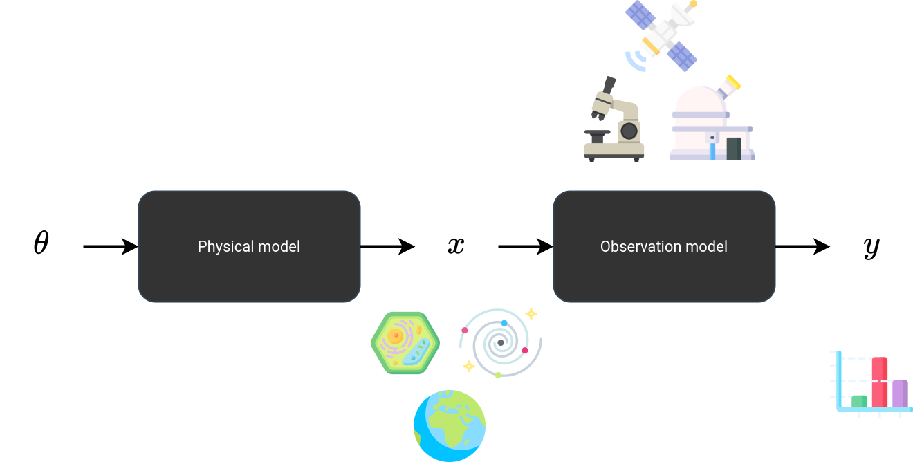]

## Inverse problems in science

Given noisy observations $y$, estimate the posterior distribution $$p(x|y) \propto p(x) p(y|x)$$ of latent states $x$.

???

All these examples are the same problem, and this diagram shows it.

A physical model produces the state $x$ of a system, a cell, a galaxy, the Earth. An observation model, the instrument, turns this state into the observation $y$, through a microscope, a telescope or a satellite. Both run forward, from causes to effects.

We want to go backward. Given $y$, which states $x$ could have produced it? There is no single answer, because the observation is noisy and incomplete. There is a distribution of answers, the posterior $p(x|y)$.

By Bayes' rule, the posterior combines two terms, one for each box. The prior $p(x)$ comes from the physical model. The likelihood $p(y|x)$ comes from the observation model.

---

class: middle

.grid[
.kol-1-4[&nbsp;]
.kol-3-8[.center[.icons[] .bold[Prior] $p(x)$]]
.kol-3-8[.center[.icons[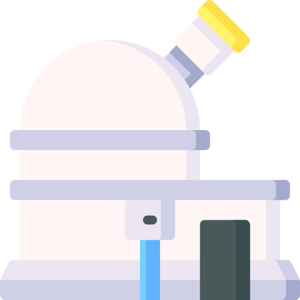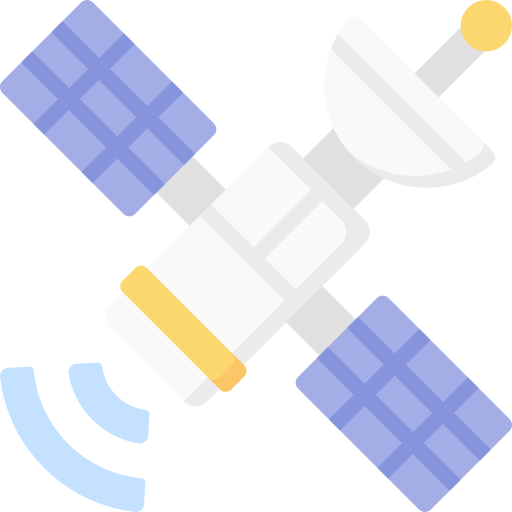] .bold[Likelihood] $p(y | x)$]]
]

.recipe[
.grid[
.kol-1-4[.italic[Cryo-EM]]
.kol-3-8[.center[3D structures of molecules]]
.kol-3-8[.center[projection, microscope blur, noise]]
]
.grid[
.kol-1-4[.italic[MRI]]
.kol-3-8[.center[full-resolution scans]]
.kol-3-8[.center[undersampled Fourier, noise]]
]
.grid[
.kol-1-4[.italic[Earth observation]]
.kol-3-8[.center[3D atmospheric states]]
.kol-3-8[.center[radiative transfer]]
]
.grid[
.kol-1-4[.italic[Black hole imaging]]
.kol-3-8[.center[images of black holes]]
.kol-3-8[.center[sparse Fourier sampling, noise]]
]
.grid[
.kol-1-4[.italic[Lensing]]
.kol-3-8[.center[undistorted images of galaxies]]
.kol-3-8[.center[lensing, telescope blur, noise]]
]
]

???

Here are the prior and the likelihood of each example.

The likelihood is the easy part. It is the instrument, which we usually know well, a projection, a Fourier transform, a radiative transfer model, plus noise.

The prior is the hard part. It is often already available, as a scientific simulator, an ocean model, a climate model, a simulation of black holes. But a simulator is a regular computer program. It runs forward and offers no way to run it backward, conditioned on an observation. In that form, the prior is of little help for inversion.

We need a representation of the prior that we can work with. Deep generative models will give us one.

---

class: middle

## Diffusion models 101

A forward diffusion process gradually turns samples $x \sim p(x)$ into noise,
$$\text{d} x\_t = f\_t x\_t \text{d}t + g\_t \text{d}w\_t.$$

.center[
.width-90[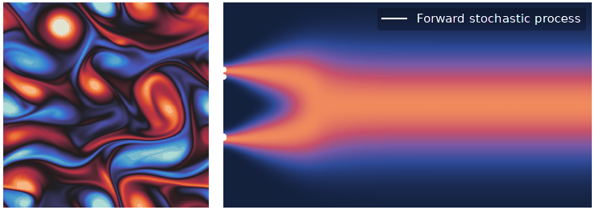]
.italic[Forward diffusion process.]
]

.footnote[Adapted from [Song](https://yang-song.net/blog/2021/score/), 2021.]

???

Diffusion models are the representation we will use. Trained on the outputs of a simulator, or on data, they learn to generate new samples of the system. And, as we will see, their way of generating can be steered by an observation.

They work by learning to reverse a gradual noising process.

The forward process adds noise to the data until nothing but noise remains. It is described by a stochastic differential equation, where $x\_t$ is the perturbed sample at time $t$. On the left, the flow of the opening slides dissolves into noise. On the right, the density of a simple 1D distribution, two modes that merge into a single Gaussian, with a few sample paths.

---

class: middle

The reverse process is also a diffusion, driven by the .bold[score] $\nabla\_{x\_t} \log p(x\_t)$,
$$\text{d}x\_t = \left[ f\_t x\_t - g\_t^2 \nabla\_{x\_t} \log p(x\_t) \right] \text{d}t + g\_t \text{d}w\_t.$$
Simulating it from noise $x\_1$ to $t = 0$ generates samples $x\_0 \sim p(x)$.

.center[
.width-90[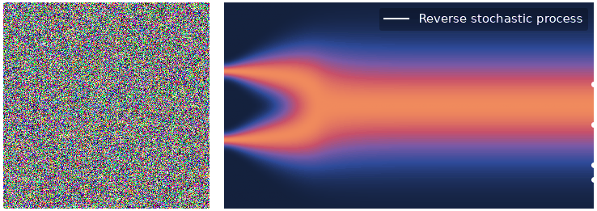]
.italic[Reverse denoising process.]
]

.footnote[Adapted from [Song](https://yang-song.net/blog/2021/score/), 2021.]

???

The time reversal of the forward process is again a stochastic differential equation. It involves the score of the perturbed data distribution at each time $t$.

To generate data, we draw pure noise and simulate the reverse process down to $t = 0$. The noise is gradually removed, and the flow emerges.

---

class: middle

.center.width-90[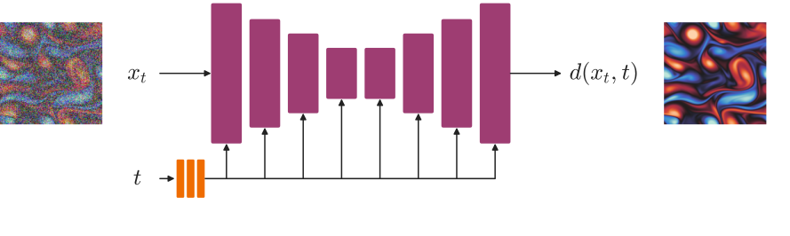]

The score is unknown, but can be approximated via a neural denoiser $d\_\theta(x\_t, t)$ trained to recover $x$ from $x\_t$,
$$\min\_\theta \\, \mathbb{E}\_{p(t)p(x)p(x\_t|x)} \left[ || d\_\theta(x\_t, t) - x ||^2\_2 \right].$$
The optimal denoiser is $\mathbb{E}[x | x\_t]$, which gives the score by Tweedie's formula,
$$\nabla\_{x\_t} \log p(x\_t) = \Sigma\_t^{-1}(\mathbb{E}[x | x\_t] - x\_t) \approx \Sigma\_t^{-1}(d\_\theta(x\_t, t) - x\_t) = s\_\theta(x\_t, t).$$

???

The reverse process needs the score, which we do not know.

We train a neural network to denoise perturbed samples $x\_t$ at all noise levels $t$, by predicting the clean sample $x$. The network sees the noisy flow and the noise level, and returns the clean flow. This is denoising score matching.

The optimal denoiser is the conditional mean $\mathbb{E}[x | x\_t]$. Tweedie's formula turns it into an estimate of the score.

---

class: middle

## Posterior sampling

.center.width-90[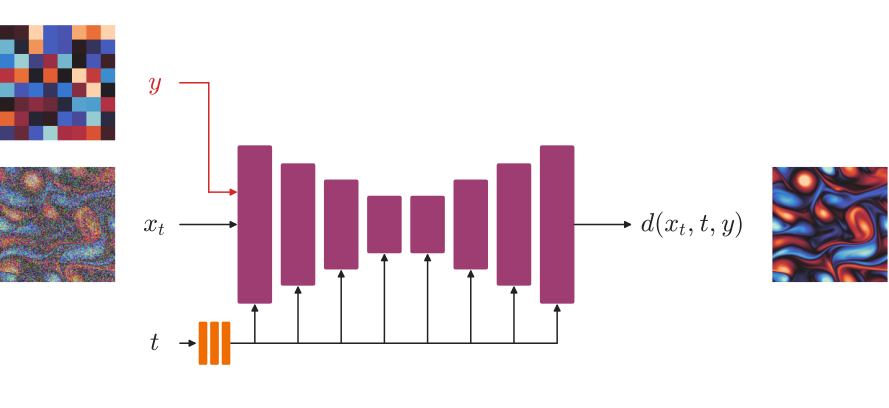]

To sample from the posterior $p(x|\textcolor{#d62728}{y})$, one can .bold[hard-wire] the observation $\textcolor{#d62728}{y}$ as an additional input of the denoiser $d\_\theta(x\_t, t, \textcolor{#d62728}{y})$ and train it on pairs $(x, \textcolor{#d62728}{y})$.

.alert[Every new instrument requires training a new network.]

???

Back to inverse problems. We want a diffusion model that gives us samples of $x$ given $y$.

The direct approach feeds $y$ to the denoiser as an extra input, here the coarse observation of the opening slide, and trains it on pairs of $x$ and $y$. This works, but the network is then tied to one instrument. Change the instrument, its resolution or its noise, and the network must be trained again.

---

class: middle

.center.width-10[]

Instead, we keep the pretrained model and .bold[hijack] its sampling with the likelihood score,
$$\text{d}x\_t = \Big[ f\_t x\_t - g\_t^2 \big( \underbrace{s\_\theta(x\_t, t)}\_{\text{pretrained prior}} + \underbrace{\nabla\_{x\_t} \log p(y | x\_t)}\_{\text{likelihood}} \big) \Big] \text{d}t + g\_t \text{d}w\_t.$$
Since $\nabla\_{x\_t} \log p(x\_t | y) = \nabla\_{x\_t} \log p(x\_t) + \nabla\_{x\_t} \log p(y | x\_t)$, this reverse process follows the posterior score, and its samples are posterior samples $x \sim p(x | y)$.

.footnote[The likelihood score of the noisy state is intractable. Approximations include [DPS](https://arxiv.org/abs/2209.14687) (Chung et al, ICLR 2023) and [MMPS](https://arxiv.org/abs/2405.13712) (Rozet et al, NeurIPS 2024).]

???

This slide carries the main idea of the talk.

By Bayes' rule, the score of the posterior is the score of the prior plus the score of the likelihood. The prior score comes from the pretrained diffusion model. The likelihood score comes from the model of the instrument.

So we can take a pretrained diffusion model, and hijack its sampling by adding the likelihood score along the way. Nothing is retrained. The same prior serves any instrument. Few generative models can be conditioned this simply after training. Diffusion models can.

There is one technical difficulty. The likelihood score must be evaluated for noisy states, and it is intractable. It can be approximated, for instance with our method, MMPS, which uses the denoiser itself.

Let us now apply this recipe to three problems studied in our group. We start in the ocean.

---

class: black-slide
background-image: url(figures/hyp-sea.png)
background-size: cover

.overlay-box.overlay-bottom-right[
.overlay-title[Coastal hypoxia]

Since 1950, over 500 coastal sites have reported hypoxia, up from fewer than 50. On the northwestern Black Sea shelf, it returns every summer.
]

.footnote[Image: [NASA Earth Observatory](https://earthobservatory.nasa.gov/images/90318/turquoise-swirls-in-the-black-sea), Norman Kuring (NASA OBPG), MODIS Aqua, May 29, 2017. Data: [Breitburg et al](https://doi.org/10.1126/science.aam7240), Science 2018.]

???

Oxygen-depleted waters are spreading in the world's oceans. Since 1950, the number of coastal sites reporting hypoxia went from fewer than 50 to more than 500. Hypoxia kills bottom life, shrinks habitats and threatens fisheries.

This is the Black Sea, seen from space. Rivers bring nutrients, and nutrients fuel these phytoplankton blooms, the turquoise swirls. The problem is most acute on the northwestern shelf, in the upper left, a shallow area fed by the Danube and the Dnieper. In summer, the water column there is stratified. Dead organic matter sinks and decomposes at the bottom, and consumes the oxygen there faster than it is renewed. The bottom waters become hypoxic.

Detecting hypoxia matters, because we can act on it. In the short term, fisheries can avoid affected areas, and scientists can target their sampling. In the long term, monitoring tells whether reducing nutrient inputs from agriculture and wastewater actually works.

But monitoring is hard. Numerical models are slow, and in-situ measurements are sparse. Satellites see the surface every day, but they do not see oxygen, and they do not see below the surface. The question is whether they can detect hypoxia at depth anyway.

---

class: middle

.avatars[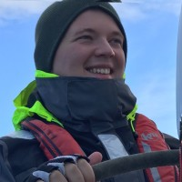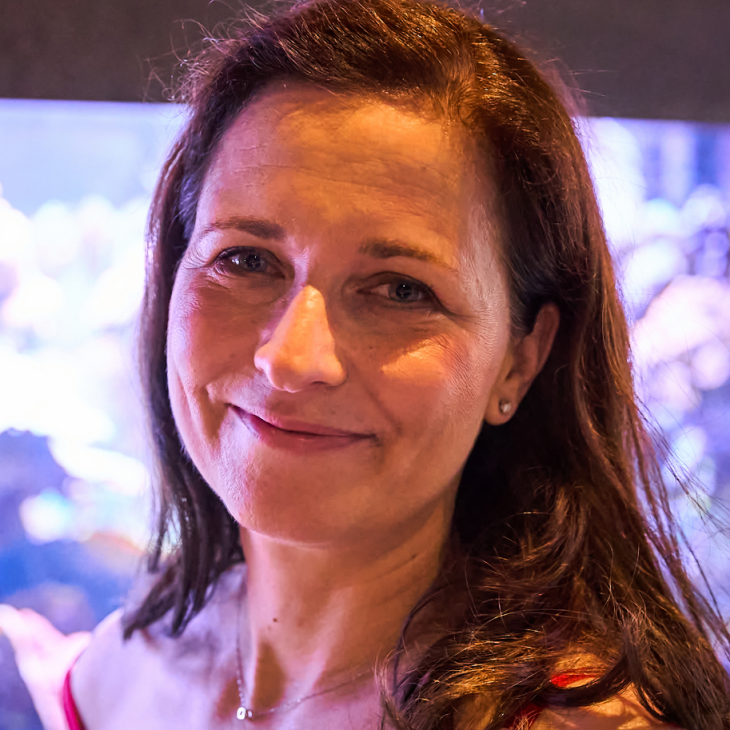]

.grid[
.kol-1-2[.center.width-95[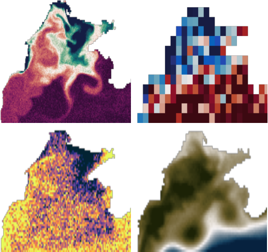]]
.kol-1-2[.center.width-95[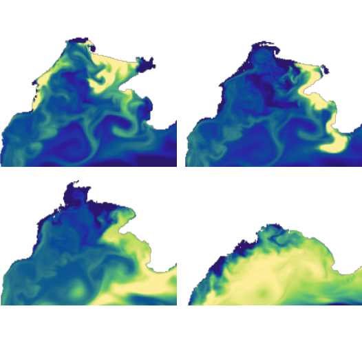]]
]
.grid[
.kol-1-2[.center[Surface observations $y$]]
.kol-1-2[.center[Oxygen at depth $x$]]
]

.footnote[Credits: [Mangeleer et al](https://arxiv.org/abs/2604.25608), submitted to JAMES, 2026 (arXiv:2604.25608).]

???

On the left, what satellites observe at the surface, chlorophyll, salinity, temperature and sea level, each at its own resolution and noise level. This is $y$.

On the right, what we want, the oxygen concentration at depth, here at four depths between the surface and 46 meters. This is $x$.

---

class: middle

.avatars[]

.center.width-85[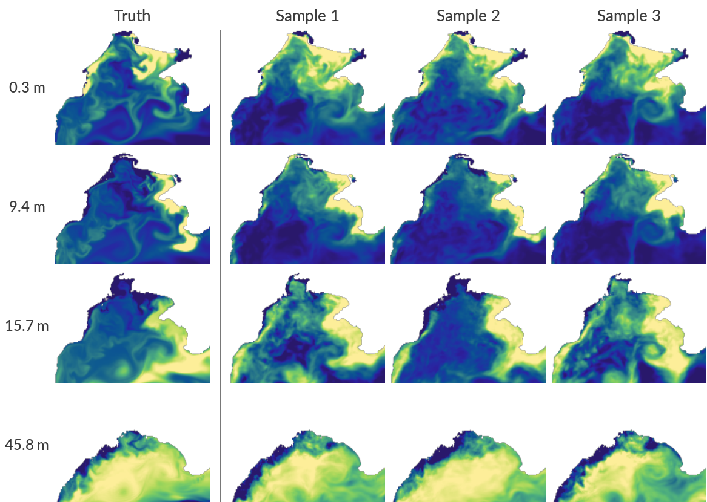]

.center[Posterior samples $x \sim p(x | y)$]

.footnote[Credits: [Mangeleer et al](https://arxiv.org/abs/2604.25608), submitted to JAMES, 2026 (arXiv:2604.25608).]

???

We train a diffusion model on decades of simulations of the Black Sea, from a coupled physical and biogeochemical model. Each state has about 4 million variables. Then we sample from the posterior, given the surface observations.

Here are the truth and three posterior samples, at four depths. Near the surface, the samples reproduce the eddies and filaments of the true oxygen field. At 15 meters, they start to disagree with each other and with the truth. At 46 meters, they look like the prior.

This is physics, not a failure of the method. The mixed layer at the top is well mixed, so the surface tells us about it. Below it, the surface tells us very little. A wide posterior is the honest answer.

In practice, in summer, we detect about a third of the hypoxic events over the shelf, from satellites alone. To do better at depth, we will need longer time windows, or measurements below the surface, such as Argo floats.

---

class: black-slide
background-image: url(figures/mar-sat.png)
background-size: cover

.overlay-box.overlay-bottom-right[
.overlay-title[Regional downscaling]

Global models resolve the atmosphere at about 30 km. Floods, crops and energy are decided at a few kilometers. Regional climate models bridge the gap, at a high computational cost.
]

.footnote[Image: [NASA Worldview](https://worldview.earthdata.nasa.gov), MODIS Terra, December 6, 2011.]

???

Our second example is regional weather and climate, here over Belgium. This is Belgium seen from space, on a December day, as a cold front crosses the country.

Global models resolve the atmosphere at about 30 kilometers. But floods, crops or wind farms depend on what happens at a few kilometers. Regional climate models fill this gap. They take the coarse global fields at their boundaries, and resolve the finer scales over a limited region.

---

class: middle

.avatars[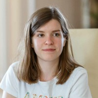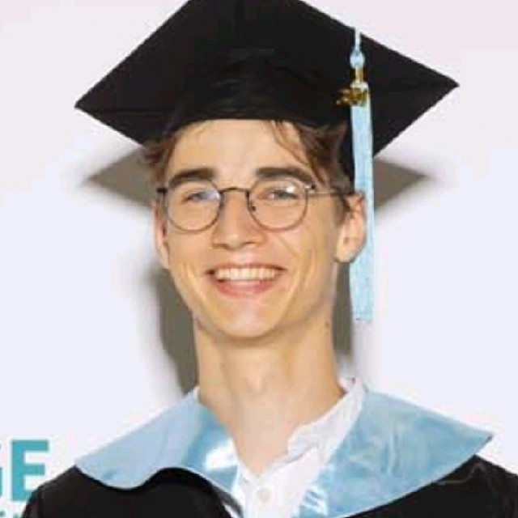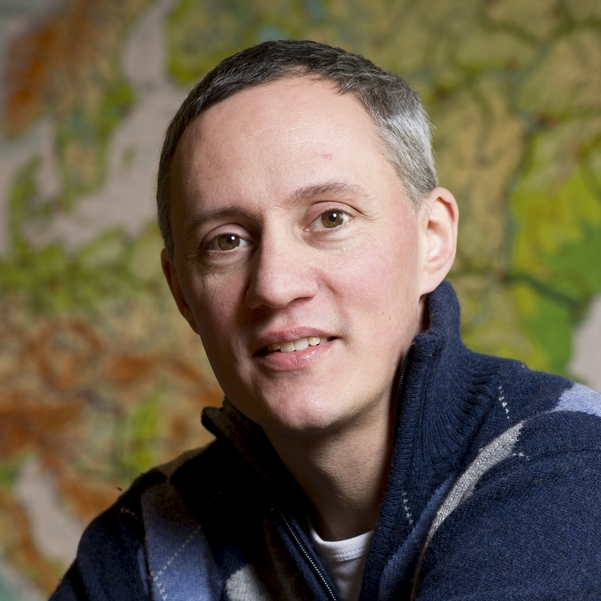]

.grid[
.kol-1-2[.center.width-90[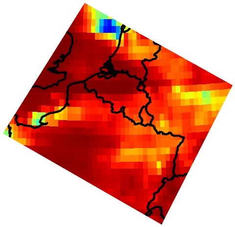]]
.kol-1-2[.center.width-90[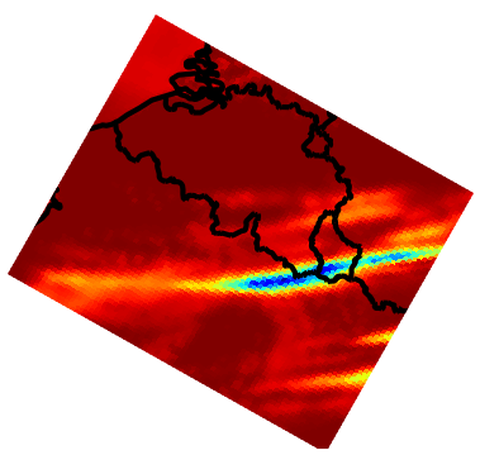]]
]
.grid[
.kol-1-2[.center[Global reanalysis (ERA5, 0.25°)]]
.kol-1-2[.center[Regional model (MAR, 5 km)]]
]

.footnote[Credits: Faulx, Peters et al, in preparation.]

???

On the left, rain from the global reanalysis ERA5. On the right, the same front simulated by the regional model MAR, at 5 kilometers. The front is now a thin band.

MAR has three limits. It is slow, two weeks on a hundred processors for a century of climate. It is deterministic, one forcing gives one answer, although many fine-scale states are compatible with it. And it cannot use observations.

MARionette addresses all three.

---

class: middle

.avatars[]

.center[
<video poster="figures/videos/marionette-era5_poster.jpg" muted loop autoplay playsinline style="height: 29em; max-width: 100%;">
<source src="figures/videos/marionette-era5.mp4" type="video/mp4">
</video>
]

.footnote[Credits: Faulx, Peters et al, in preparation.]

???

MARionette is a diffusion model trained to emulate MAR. Given the coarse ERA5 forcing, it generates hourly fields of all MAR variables at 5 kilometers, in seconds instead of hours.

Here are ten days of July 2011. The top row is the ERA5 forcing, updated every six hours. Below are MAR and three MARionette samples. The samples agree on the large scales, which ERA5 determines, and differ in the details, such as where individual showers fall, which ERA5 does not determine. MARionette also generates variables that are not given as input, such as solar radiation.

---

class: middle

.avatars[]

.bleed[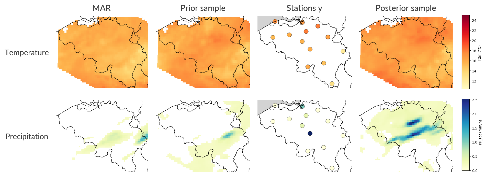]

.center[Posterior sampling conditioned on 14 weather stations $y$, which MAR cannot assimilate.]

.footnote[Credits: Faulx, Peters et al, in preparation.]

???

And because MARionette is a diffusion model, we can condition it on observations, here the measurements of 14 weather stations, exactly as in the recipe. MAR cannot do this.

On this evening of August 2021, one station in the center of the country records heavy rain. MAR misses it, and so does a sample without observations. The posterior sample puts a rain band over that station. These results are still preliminary.

So, for Belgium, we get kilometer-scale weather in seconds, as an ensemble, and anchored to measurements.

---

class: black-slide
background-image: url(figures/satellite-crop.gif)
background-size: cover

.overlay-box.overlay-bottom-left[
.overlay-title[Observations $y$]

Every day, satellites and ground stations deliver millions of sparse, noisy and indirect measurements of the atmosphere.
]

.footnote[Animation: [ESA/ATG medialab](https://www.esa.int/ESA_Multimedia), Sentinel-1.]

???

Our third example is the atmosphere as a whole. Every day, satellites and weather stations deliver millions of observations. They are sparse, noisy and indirect, and they keep arriving over time. This is $y$.

---

class: black-slide
background-image: url(figures/da-x.png)
background-size: cover

.overlay-box.overlay-bottom-right[
.overlay-title[Trajectories $x\_{1:L}$]

Reanalyses of the past and the initial conditions of every weather forecast require the full state of the atmosphere, estimated from these observations.
]

.footnote[Data: [ERA5](https://doi.org/10.1002/qj.3803) reanalysis, 10 m wind speed, March 21, 2021.]

???

What we want is the trajectory of the full 3D atmosphere over time, here shown by the surface wind at one instant. Estimating it from observations is data assimilation. It produces the reanalyses that climate science relies on, and the starting point of every weather forecast.

---

class: middle

## Data assimilation

We estimate trajectories $x\_{1:L}$ given observations $y\_{1:L}$, as the posterior
$$p(x\_{1:L} | y\_{1:L}) \propto p(x\_1) p(y\_1 | x\_1) \prod\_{i=2}^{L} p(x\_{i} | x\_{i-1}) p(y\_{i} | x\_{i}).$$

.center.width-100[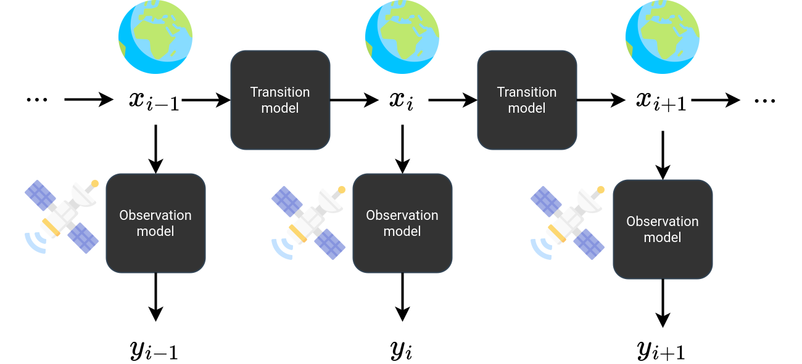]

???

The atmosphere evolves from one state to the next, and each state is observed by our instruments. We want the posterior over whole trajectories, given all observations.

This problem is as old as numerical weather prediction. The methods used operationally today, such as 4D-Var and ensemble Kalman filters, rely on Gaussian or linear assumptions about the dynamics.

In our group, we asked whether a diffusion prior over trajectories, which makes no such assumption, could do the job. The next slides show how we did it, in three steps.

---

class: middle

.avatars[]

.center.width-100[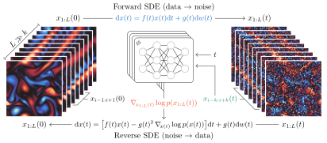]

SDA trains a diffusion model on short windows. If the dynamics are Markovian,
$$\nabla\_{x\_i} \log p(x\_{1:L}) = \nabla\_{x\_i} \log p(x\_{i-k:i+k}),$$
and approximately so for noisy $x\_{1:L}(t)$. The score of a long trajectory is thus assembled from short windows, and posterior sampling proceeds as before.

.footnote[Credits: [Rozet and Louppe](https://arxiv.org/abs/2306.10574), NeurIPS 2023 (arXiv:2306.10574).]

???

The first step is our score-based data assimilation, SDA. We train a diffusion model on short windows of a trajectory. Because the dynamics are Markovian, each state only interacts with its close neighbors in time. So the score of a long trajectory can be assembled from the scores of short windows, all computed in parallel. This is exact for clean trajectories, and approximate for noisy ones. Then we sample from the posterior, as before.

---

class: middle

.avatars[]

.center.width-100[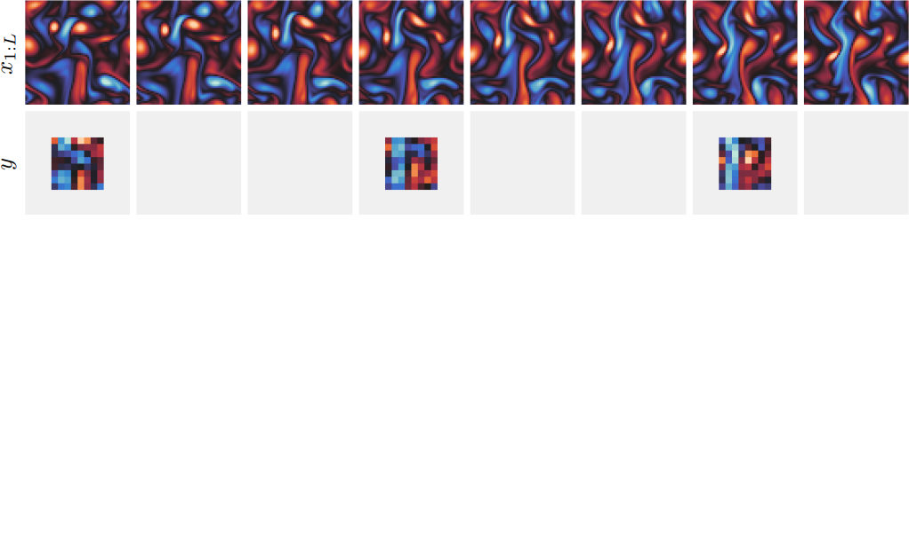]

.center[Ground truth $x\_{1:L}$ and coarse, noisy, sparse observations $y$.]

.footnote[Credits: [Rozet and Louppe](https://arxiv.org/abs/2306.10574), NeurIPS 2023 (arXiv:2306.10574).]

???

A toy example, a 2D turbulent flow. The top row is the true trajectory. The second row shows what we observe, coarse, noisy, and only every few time steps.

---

class: middle
count: false

.avatars[]

.center.width-100[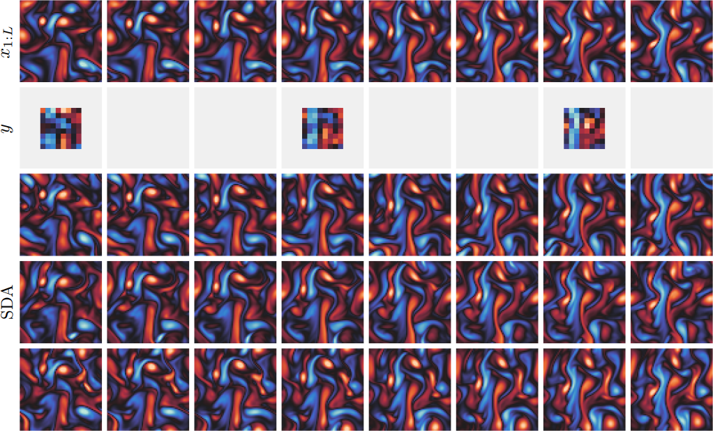]

.center[Posterior samples of the trajectory, given $y$.]

.footnote[Credits: [Rozet and Louppe](https://arxiv.org/abs/2306.10574), NeurIPS 2023 (arXiv:2306.10574).]

???

And these are posterior samples. They are consistent with the observations, and they differ where the observations leave room.

---

class: middle

.avatars[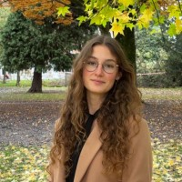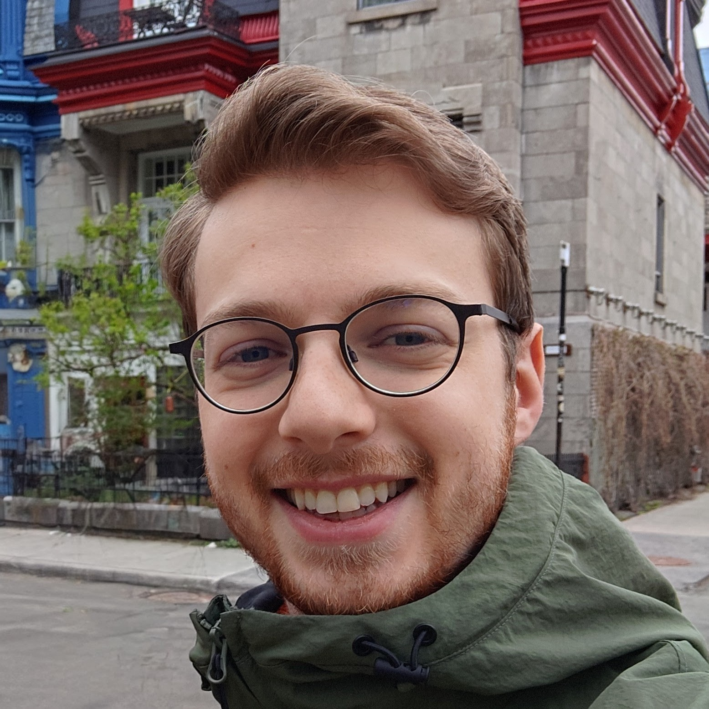]

## Long trajectories

Training a diffusion model on whole trajectories $x\_{1:L}$ is too expensive for long horizons. Instead, models of short windows $x\_{i-k:i+k}$ must be composed at sampling time.

.center.width-100[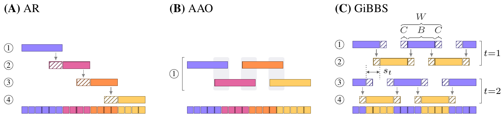]

GiBBS redraws blocks $x\_{i:j}$ from their exact conditionals $p(x\_{i:j} | x\_{i-k:i-1}, x\_{j+1:j+k}, y)$, in parallel. Unlike AR and AAO (SDA), it converges to $p(x\_{1:L} | y)$.

.footnote[Credits: Bodart et al, under review at ICLR 2027.]

???

For long trajectories, such as a whole season, we cannot train a model over the whole horizon. We must compose short windows at sampling time, and how we compose them matters.

Rolling out one window after the other ignores future observations, and errors accumulate. Composing all windows at once, as SDA does, has a subtler problem. Each window only sees its neighbors, so the information brought by an observation at one time step does not travel far enough. It fails to reach states far in the past or far in the future, where it should still matter.

GiBBS is a Gibbs sampler. It repeatedly redraws blocks of states, given their neighbors and the observations. All blocks of the same color are redrawn in parallel, and the blocks shift from one cycle to the next. Over the cycles, the information of each observation propagates along the whole trajectory, and the chain converges to the true posterior.

---

class: middle

.avatars[]

.center.width-100[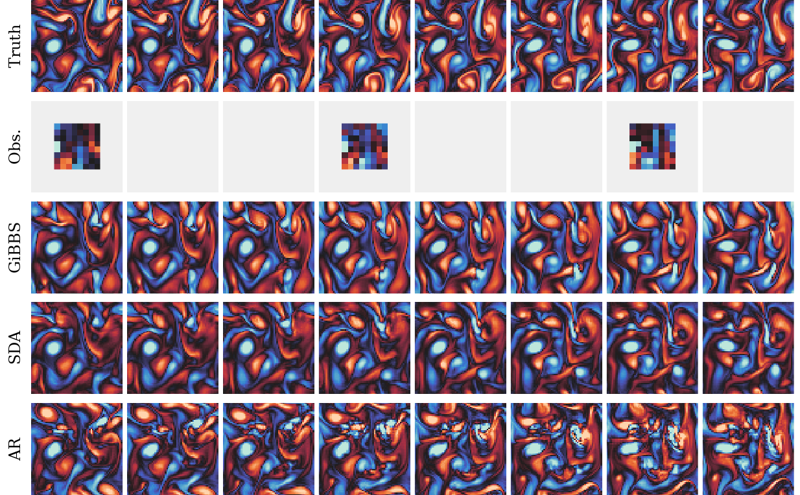]

.center[Posterior samples of the trajectory, given $y$.]

.footnote[Credits: Bodart et al, under review at ICLR 2027.]

???

Here the observations only cover the middle of the trajectory. GiBBS keeps the vortices coherent all along. The all-at-once composition smooths them out, and the rollout drifts away.

So far, every state was a small 2D flow, a few thousand numbers. With SDA and GiBBS, we can now handle long trajectories of them. But the real atmosphere is not a small 2D flow.

---

class: black-slide
background-image: url(figures/earth-bg.png)
background-size: cover

.overlay-box.overlay-bottom-right[
.overlay-title[$O(10^{10})$ variables]

At 0.25°, 6 variables on 13 pressure levels, hourly over two weeks, a trajectory $x\_{1:L}$ has $721 \times 1440 \times 6 \times 13 \times 24 \times 14 \approx 27 \times 10^9$ variables.
]

???

At the resolution of modern weather models, a two-week trajectory of the atmosphere has about 27 billion variables. That is far beyond what a diffusion model can handle directly.

---

class: middle

.avatars[]

## Latent diffusion

.center.width-95[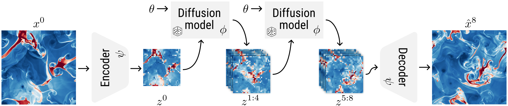]

.grid[
.kol-3-4[
.center[
<video poster="figures/videos/lola_euler_poster.jpg" controls="" muted="" loop="" width="100%" autoplay>
        <source src="figures/videos/lola_euler.mp4" type="video/mp4">
</video>
]
]
.kol-1-4[  LDMs trained on compressed latent states $z = E(x)$ remain accurate even at high compression rates.]
]

.footnote[Credits: [Rozet et al](https://arxiv.org/abs/2507.02608), NeurIPS 2025 (arXiv:2507.02608).]

???

So we compress. A latent diffusion model learns the prior in a compressed space, much smaller than the original one, and decodes its samples back. Our work on LoLA showed that this works well for physics, even at high compression. This was a surprise. Physics is defined in the original space, through equations on the full fields, and we expected compression to break it. It does not. The latent space retains what matters for the dynamics.

---

class: middle

.avatars[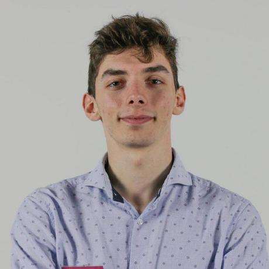]

## Appa

.center.width-80[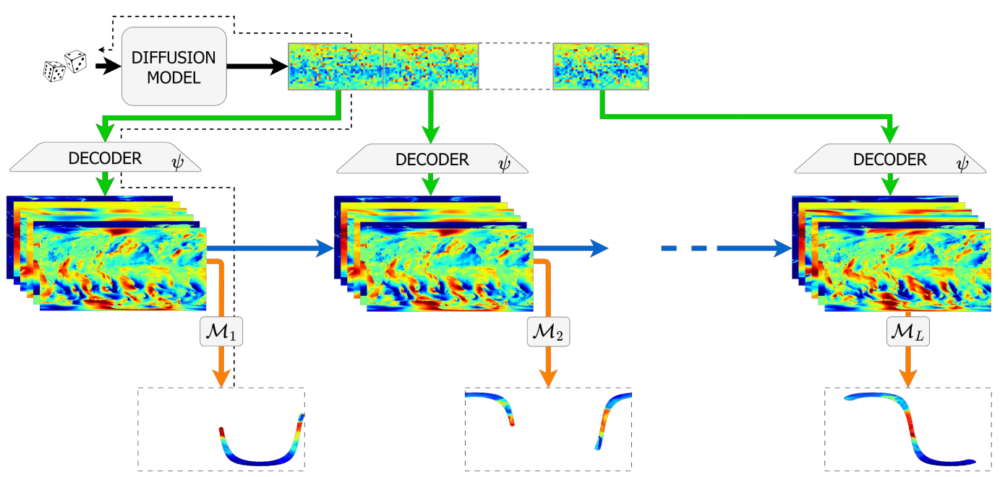]

An autoencoder compresses each atmospheric state $x$ 450 times into a latent state $z = E(x)$. A latent diffusion model generates trajectories $z\_{1:L}$, decoded as $x\_{1:L} = D(z\_{1:L})$. Posterior sampling runs in latent space.

.footnote[Credits: [Andry et al](https://arxiv.org/abs/2504.18720), NeurIPS ML4PS workshop 2025 (arXiv:2504.18720).]

???

Based on this idea, we built Appa, for the global atmosphere. An autoencoder compresses each state 450 times. A latent diffusion model, with a billion parameters, generates trajectories in that compressed space. Data assimilation then happens in latent space, at the scale of the whole Earth.

---

class: middle

.avatars[]

.center[
<video poster="figures/videos/appa_reanalysis_poster.jpg" controls="" muted="" loop="" width="70%" autoplay>
<source src="figures/videos/appa_reanalysis_1week.mp4" type="video/mp4">
</video>
]

.footnote[Credits: [Andry et al](https://arxiv.org/abs/2504.18720), NeurIPS ML4PS workshop 2025 (arXiv:2504.18720).]

???

Here is a week of reanalysis with Appa. Rows 1 and 4 are the truth. Rows 2 and 5 are the observations, satellite tracks and weather stations. Rows 3 and 6 are Appa's posterior samples.

---

class: middle

.avatars[]

## Assimilating with a forecaster

Diffusion-based forecasters such as GenCast sample the next state $p(x\_k | x\_{k-1})$. They were built to forecast, not to assimilate. Within a particle filter, posterior sampling conditions them on each new observation $y\_k$, without retraining, and tracks the current state $p(x\_k | y\_{1:k})$.

.center.width-90[]

.center[10 m zonal wind. FA-APF stays on the true trajectory, GenCast alone drifts.]

.footnote[Credits: [Savary et al](https://arxiv.org/abs/2605.20028), ICML 2026 (arXiv:2605.20028).]

???

We end with forecasting.

Today, the best weather forecasts come from machine learning models, such as GenCast from Google DeepMind, itself a diffusion model. GenCast takes the current state of the atmosphere and produces the next one. It was trained for that, and only for that. It has never seen an observation.

But a forecast is only as good as its starting point. Weather centers produce that starting point with data assimilation, running continuously. Every few hours, they take the last forecast, compare it with the new observations, and correct it. The corrected state, the analysis, starts the next forecast. This cycle has run for decades, with physical models and Gaussian assumptions.

The answer is yes. A forecaster alone is enough to run this cycle.

We embed it in a particle filter, an ensemble of possible states that plays the role of the analysis. At each cycle, each member is moved forward by the forecaster, and conditioned on the new observations. That conditioning is the posterior sampling of the beginning of the talk, with GenCast as the prior. No retraining, no extra model, just the forecaster and the observations.

The figure shows the result. The first row is the truth. The second is our filter, cycling with realistic observations. The third is GenCast alone, without observations. After a week, GenCast alone has drifted away from the real weather. The filter stays on track.

So any diffusion-based forecaster, trained by someone else and for another purpose, can be turned into an operational data assimilation system.

---

class: middle

## Conclusions

.grid[
.kol-1-3[.center[.bold[Hypoxia] .smaller[Satellites detect a third of summer hypoxic events in the Black Sea, from the surface alone.]]]
.kol-1-3[.center[.bold[Downscaling] .smaller[Kilometer-scale weather for Belgium, in seconds, anchored to ground stations.]]]
.kol-1-3[.center[.bold[Data assimilation] .smaller[Global reanalyses from sparse observations, and data assimilation with existing forecasters.]]]
]

.challenge[
- Can we trust a posterior when there is no ground truth to compare with?
- What happens when the prior was learned from imperfect simulations?
- Can priors be learned from noisy observations alone?
- Can we sample $10^{10}$ variables as fast as the weather changes?
]

???

Let me come back to the three examples.

In the Black Sea, satellites alone can now detect a third of the summer hypoxic events. Over Belgium, we get kilometer-scale weather in seconds, as an ensemble, and anchored to weather stations. And for the whole atmosphere, we can reconstruct the past from sparse observations, and turn existing forecasters into data assimilation systems.

None of this is finished. Four questions keep us busy.

Can we trust the posteriors? In science, we rarely know the true state, so we need ways to check that the uncertainty we report is the right one.

What if the prior is wrong? A prior learned from a simulator inherits its biases, and the posterior can then be confidently wrong.

Can we do without simulators? In some fields, we only have noisy and incomplete observations. Learning the prior directly from them is possible, and we have started to do it.

And can we go fast enough? Weather centers assimilate hundreds of millions of observations every few hours. Our methods are not there yet.

---

class: black-slide
background-image: url(figures/closing.png)
background-size: cover

.overlay-box.overlay-center.overlay-equation[
$$p(x | y) \propto p(x) \, p(y | x)$$
]

???

I will leave you with the equation we started from.

Molecules, knees, black holes, galaxies, the Black Sea, the rain over Belgium, the whole atmosphere. Very different problems, but always the same recipe. A prior for the physics of the system, learned by a diffusion model. A likelihood for the instrument. And posterior sampling, which combines them.

Thank you.

---

count: false

.center.width-10[]

.center[

.width-13.circle[] 
.width-13.circle[] 
.width-13.circle[] 
.width-13.circle[] 
.width-13.circle[] 
.width-13.circle[]

.width-13.circle[] 
.width-13.circle[] 
.width-13.circle[] 
.width-13.circle[] 
.width-13.circle[] 
.width-13.circle[]

.width-13.circle[] 
.width-13.circle[] 
.width-13.circle[] 
.width-13.circle[]

.smaller[François Rozet, Gérôme Andry, Victor Mangeleer, Thomas Savary, Elise Faulx, Sacha Peters, Fanny Bodart, Sacha Lewin, Omer Rochman, Matthias Pirlet, Marilaure Grégoire, Xavier Fettweis, François Lanusse, Ruben Ohana, Michael McCabe, Shirley Ho]

]

---

class: middle, center, end-slide
count: false

The end.
