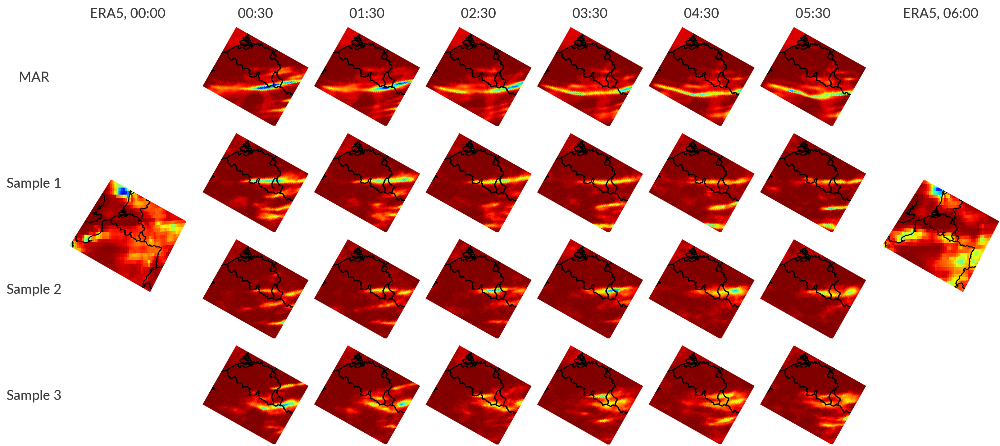
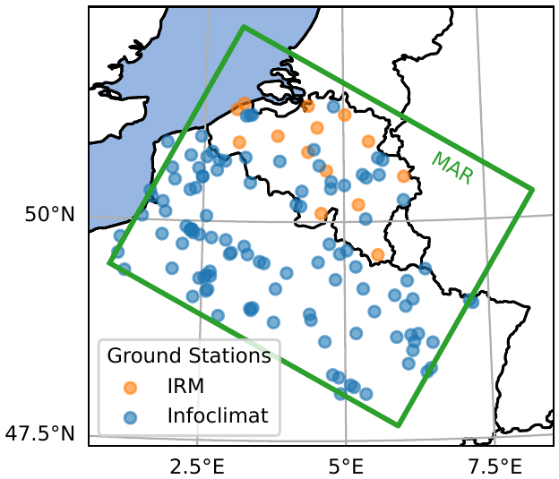

class: black-slide
background-image: url(figures/title-bg.gif)
background-size: cover

.overlay-box.overlay-title-slide[
.overlay-title[Inverting scientific images with deep generative models]

.title-author[.title-author-text[Gilles Louppe .smaller[[g.louppe@uliege.be](mailto:g.louppe@uliege.be)]]]

.title-footer[.smaller[AI4Sci 2026, Mainz October 8, 2026]]
]

???

Thank you for the invitation. It is a pleasure to be here.

This talk is about inverse problems in science, and how deep generative models, diffusion models in particular, can solve them. We will start from small examples and end with the state of the ocean and of the whole atmosphere.

---

class: middle, black-slide, center
background-image: url(figures/title-bg.gif)
background-size: cover

.bold.larger.shadowed[From a noisy observation $y$...]

???

Suppose we observe this. It is a coarse and noisy observation $y$ of a 2D turbulent flow, averaged over large blocks.

---

class: middle, black-slide, center

.bg-video[<video autoplay muted loop playsinline poster="figures/x.png" src="figures/videos/teaser-x.mp4"></video>]

.bold.larger.shadowed[... can we recover   all plausible physical states $x$?]

???

Given $y$, we want to recover all plausible physical states $x$ that could have produced it. Here is one of them, the true flow. Many others are consistent with the same blocks. We want them all, as a distribution.

Here are five examples from science, from the smallest scales to the largest.

---

class: black-slide
background-image: url(figures/mic-y.png)
background-size: cover

.overlay-box.overlay-intro[
.overlay-title[Cryo-electron microscopy]

Thousands of noisy 2D projections $y$ of a molecule, in unknown orientations.
]

.footnote[Simulated particle images of the .italic[P. falciparum] 80S ribosome (EMD-2660).]

???

Cryo-electron microscopy images biomolecules frozen in ice. Each particle image is a 2D projection of the molecule, in an unknown orientation, blurred by the microscope and buried in noise. The electron dose must stay low, or the sample is destroyed. A dataset contains hundreds of thousands of such images. They are the observation $y$, simulated here from a ribosome structure.

---

class: black-slide
background-image: url(figures/mic-x.png)
background-size: cover

.overlay-box.overlay-intro[
.overlay-title[Cryo-electron microscopy]

The 3D structure $x$ of the molecule.
]

.footnote[Structure: EMD-2660, [Wong et al](https://doi.org/10.7554/eLife.03080), eLife 2014. Flow-prior reconstruction: [Zhou et al](https://arxiv.org/abs/2410.08631), ICLR 2025 (arXiv:2410.08631).]

???

The state $x$ is the 3D structure of the molecule, here the 80S ribosome of the malaria parasite, at near-atomic resolution. With a generative prior over density maps, CryoFM reconstructs this structure from the real particle images of this dataset.

---

class: black-slide
background-image: url(figures/mri-y.png)
background-size: cover

.overlay-box.overlay-top-right[
.overlay-title[Accelerated MRI]

Undersampling k-space speeds up the scan but leaves aliased images $y$.
]

.footnote[Credits: [Rozet et al](https://arxiv.org/abs/2405.13712), NeurIPS 2024 (arXiv:2405.13712).]

???

To speed up MRI scans, only a fraction of k-space is measured, here one line out of six. Inverting these partial measurements naively gives blurry, aliased images. This is the observation $y$.

---

class: black-slide
background-image: url(figures/mri-x.png)
background-size: cover

.overlay-box.overlay-top-right[
.overlay-title[Accelerated MRI]

The full-resolution scans $x$.
]

.footnote[Credits: [Rozet et al](https://arxiv.org/abs/2405.13712), NeurIPS 2024 (arXiv:2405.13712).]

???

These are the full-resolution knee scans $x$ we want to recover. In our work, the diffusion prior over such scans was learned from undersampled measurements only, by expectation-maximization.

---

class: black-slide
background-image: url(figures/sat-y.png)
background-size: cover

.overlay-box.overlay-intro-right[
.overlay-title[Earth observation]

Satellites measure infrared radiances $y$, not the state of the atmosphere.
]

.footnote[Data: [GridSat-B1](https://www.ncei.noaa.gov/products/gridded-geostationary-brightness-temperature), NOAA NCEI, infrared brightness temperatures, March 21, 2021, 00:00 UTC.]

???

Weather satellites do not measure the state of the atmosphere. They measure radiances, here infrared brightness temperatures seen by the geostationary satellites on March 21, 2021, at midnight UTC. Cold cloud tops appear white. This is the observation $y$.

---

class: black-slide
background-image: url(figures/sat-x.png)
background-size: cover

.overlay-box.overlay-intro-right[
.overlay-title[Earth observation]

The state $x$ of the atmosphere, here water vapour, wind, temperature and humidity.
]

.footnote[Data: [ERA5](https://doi.org/10.1002/qj.3803) reanalysis, via [WeatherBench 2](https://github.com/google-research/weatherbench2), March 21, 2021, 00:00 UTC.]

???

The state $x$ is the full 3D state of the atmosphere at the same time, here represented by water vapour, surface wind, temperature and humidity from the ERA5 reanalysis. Recovering it from observations is data assimilation. We will come back to it at the end of the talk.

---

class: black-slide
background-image: url(figures/bh-y.png)
background-size: cover

.overlay-box.overlay-top-left[
.overlay-title[Black hole imaging]

A few radio dishes across the Earth sample the Fourier transform $y$ of the image.
]

.footnote[Data: [EHT Collaboration](https://github.com/eventhorizontelescope/2019-D01-01), M87*, April 11, 2017.]

???

The Event Horizon Telescope combines radio dishes across the Earth. Each pair of dishes measures one Fourier component of the image, and the rotation of the Earth sweeps these measurements along tracks. These are all the measurements of M87* collected on April 11, 2017. This is the observation $y$. Most of the Fourier plane is empty.

---

class: black-slide
background-image: url(figures/bh-x.png)
background-size: cover

.overlay-box.overlay-top-left[
.overlay-title[Black hole imaging]

Images $x$ of M87*, all consistent with the data.
]

.footnote[Credits: [Wu et al](https://arxiv.org/abs/2405.18782), NeurIPS 2024 (arXiv:2405.18782).]

???

These are posterior samples of the image of M87*, from the real EHT data, under a diffusion prior trained on black hole simulations. Every one of them is consistent with the measurements. The ring is robust, the fine structure is not.

---

class: black-slide
background-image: url(figures/lens-y.png)
background-size: cover

.overlay-box.overlay-intro-right[
.overlay-title[Gravitational lensing]

A foreground galaxy distorts a background galaxy into an Einstein ring $y$.
]

.footnote[Credits: [Adam et al](https://arxiv.org/abs/2211.03812), NeurIPS ML4PS workshop 2022 (arXiv:2211.03812).]

???

A massive foreground galaxy bends the light of a more distant galaxy into an Einstein ring. This noisy ring is the observation $y$, simulated here.

---

class: black-slide
background-image: url(figures/lens-x.png)
background-size: cover

.overlay-box.overlay-intro-right[
.overlay-title[Gravitational lensing]

Undistorted images $x$ of the background galaxy, all consistent with the data.
]

.footnote[Credits: [Adam et al](https://arxiv.org/abs/2211.03812), NeurIPS ML4PS workshop 2022 (arXiv:2211.03812).]

???

These are posterior samples of the background galaxy before distortion, under a diffusion prior trained on images of galaxies. Lensed again, each of them reproduces the observed ring down to the noise level.

---

class: middle

.center.width-80[]

## Inverse problems in science

Given noisy observations $y$, estimate the posterior distribution $$p(x|y) \propto p(x) p(y|x)$$ of latent states $x$.

???

All these examples are the same problem. Measurements in science are neither direct nor perfect. They are noisy, limited in resolution, incomplete or indirect. We can only infer the states that could have produced them, and quantify our uncertainty.

Formally, we want the posterior $p(x|y)$.

The problem is hard for two reasons. Our models of the world are forward models. They simulate observations from states, but they cannot be inverted directly. And the problem is ill-posed. There is no single solution, only a distribution of plausible ones.

---

class: middle

.grid[
.kol-1-4[&nbsp;]
.kol-3-8[.center[.icons[] .bold[Prior] $p(x)$]]
.kol-3-8[.center[.icons[] .bold[Likelihood] $p(y | x)$]]
]

.recipe[
.grid[
.kol-1-4[.italic[Cryo-EM]]
.kol-3-8[.center[3D structures of molecules]]
.kol-3-8[.center[projection, microscope blur, noise]]
]
.grid[
.kol-1-4[.italic[MRI]]
.kol-3-8[.center[full-resolution scans]]
.kol-3-8[.center[undersampled Fourier, noise]]
]
.grid[
.kol-1-4[.italic[Earth observation]]
.kol-3-8[.center[3D atmospheric states]]
.kol-3-8[.center[radiative transfer]]
]
.grid[
.kol-1-4[.italic[Black hole imaging]]
.kol-3-8[.center[images of black holes]]
.kol-3-8[.center[sparse Fourier sampling, noise]]
]
.grid[
.kol-1-4[.italic[Lensing]]
.kol-3-8[.center[undistorted images of galaxies]]
.kol-3-8[.center[lensing, telescope blur, noise]]
]
]

???

Although these problems come from very different fields, they are all solved with the same recipe.

The prior $p(x)$ encodes what plausible states look like. It carries the physics of the system, through the simulators that produce it or the data that record it. It is too complex to write down by hand, but a deep generative model, here a diffusion model, can learn it.

The likelihood $p(y|x)$ encodes how the instrument turns a state into an observation. It carries the physics of the measurement process.

The rest of this talk is about how to combine the two, and how to make it work at very large scales.

---

class: middle

## Diffusion models 101

A forward diffusion process gradually turns samples $x \sim p(x)$ into noise,
$$\text{d} x\_t = f\_t x\_t \text{d}t + g\_t \text{d}w\_t.$$

.center[
.width-90[]
.italic[Forward diffusion process.]
]

.footnote[Adapted from [Song](https://yang-song.net/blog/2021/score/), 2021.]

???

Diffusion models are deep generative models that learn to reverse a gradual noising process.

The forward process adds noise to the data until nothing but noise remains. It is described by a stochastic differential equation, where $x\_t$ is the perturbed sample at time $t$. On the left, the flow of the opening slides dissolves into noise. On the right, the density of a simple 1D distribution, two modes that merge into a single Gaussian, with a few sample paths.

---

class: middle

The reverse process is also a diffusion, driven by the .bold[score] $\nabla\_{x\_t} \log p(x\_t)$,
$$\text{d}x\_t = \left[ f\_t x\_t - g\_t^2 \nabla\_{x\_t} \log p(x\_t) \right] \text{d}t + g\_t \text{d}w\_t.$$
Simulating it from noise $x\_1$ to $t = 0$ generates samples $x\_0 \sim p(x)$.

.center[
.width-90[]
.italic[Reverse denoising process.]
]

.footnote[Adapted from [Song](https://yang-song.net/blog/2021/score/), 2021.]

???

The time reversal of the forward process is again a stochastic differential equation. It involves the score of the perturbed data distribution at each time $t$.

To generate data, we draw pure noise and simulate the reverse process down to $t = 0$. The noise is gradually removed, and the flow emerges.

---

class: middle

.center.width-90[]

The score is unknown. We train a neural denoiser $d\_\theta(x\_t, t)$ to recover $x$ from $x\_t$,
$$\min\_\theta \\, \mathbb{E}\_{p(t)p(x)p(x\_t|x)} \left[ || d\_\theta(x\_t, t) - x ||^2\_2 \right].$$
The optimal denoiser is $\mathbb{E}[x | x\_t]$, which gives the score by Tweedie's formula,
$$\nabla\_{x\_t} \log p(x\_t) = \Sigma\_t^{-1}(\mathbb{E}[x | x\_t] - x\_t) \approx \Sigma\_t^{-1}(d\_\theta(x\_t, t) - x\_t) = s\_\theta(x\_t, t).$$

???

The reverse process needs the score, which we do not know.

We train a neural network to denoise perturbed samples $x\_t$ at all noise levels $t$, by predicting the clean sample $x$. The network sees the noisy flow and the noise level, and returns the clean flow. This is denoising score matching.

The optimal denoiser is the conditional mean $\mathbb{E}[x | x\_t]$. Tweedie's formula turns it into an estimate of the score.

---

class: middle

## Posterior sampling

.center.width-90[]

To sample from the posterior $p(x|y)$, one can .bold[hard-wire] the observation $y$ as an additional input of the denoiser $d\_\theta(x\_t, t, y)$ and train it on pairs $(x, y)$.

.alert[Every new instrument requires training a new network.]

???

We now turn to inverse problems.

The direct approach adds $y$ as an extra input of the denoiser, here the coarse observation of the opening slide, and trains on pairs $(x, y)$. It works when such pairs are plentiful, but the network is tied to one observation model. If the instrument, its resolution or its noise level changes, it must be trained again.

---

class: middle

.center.width-10[]

Instead, we keep the pretrained model and .bold[hijack] its sampling with the likelihood score,
$$\text{d}x\_t = \Big[ f\_t x\_t - g\_t^2 \big( \underbrace{s\_\theta(x\_t, t)}\_{\text{pretrained prior}} + \underbrace{\nabla\_{x\_t} \log p(y | x\_t)}\_{\text{likelihood}} \big) \Big] \text{d}t + g\_t \text{d}w\_t.$$
Since $\nabla\_{x\_t} \log p(x\_t | y) = \nabla\_{x\_t} \log p(x\_t) + \nabla\_{x\_t} \log p(y | x\_t)$, this reverse process follows the posterior score, and its samples are posterior samples $x \sim p(x | y)$.

.footnote[The likelihood score of the noisy state is intractable. Approximations include [DPS](https://arxiv.org/abs/2209.14687) (Chung et al, ICLR 2023) and [MMPS](https://arxiv.org/abs/2405.13712) (Rozet et al, NeurIPS 2024).]

???

This slide carries the main idea of the talk.

By Bayes' rule, the posterior score is the sum of the prior score and the likelihood score. The evidence $\log p(y)$ does not depend on $x\_t$ and vanishes. The prior score is given by the pretrained denoiser. The likelihood score is given by the model of the instrument.

We can therefore hijack the sampling of a pretrained diffusion model by adding the likelihood score to its score. Nothing is retrained. Few generative models can be conditioned this simply after training. Diffusion and score-based models can.

The likelihood score of the noisy state $x\_t$ is intractable, since it integrates over all clean states consistent with $x\_t$. Our approximation, MMPS, estimates the mean and covariance of $p(x | x\_t)$ with the denoiser.

---

class: black-slide
background-image: url(figures/hyp-sea.png)
background-size: cover

.overlay-box.overlay-bottom-right[
.overlay-title[Coastal hypoxia]

Since 1950, over 500 coastal sites have reported hypoxia, up from fewer than 50. On the northwestern Black Sea shelf, it returns every summer.
]

.footnote[Image: [NASA Earth Observatory](https://earthobservatory.nasa.gov/images/90318/turquoise-swirls-in-the-black-sea), Norman Kuring (NASA OBPG), MODIS Aqua, May 29, 2017. Data: [Breitburg et al](https://doi.org/10.1126/science.aam7240), Science 2018.]

???

Our first example comes from the ocean. Oxygen-depleted waters are spreading. Since 1950, more than 500 coastal sites have reported hypoxia, up from fewer than 50, and the open ocean has lost about 2% of its oxygen. Hypoxia kills bottom fauna, shrinks habitats and threatens fisheries.

On the northwestern shelf of the Black Sea, nutrients brought by the rivers fuel phytoplankton blooms, visible here from space. In summer, the water column is stratified. Organic matter sinks and decomposes, and the oxygen it consumes at the bottom is not renewed. Oxygen drops below 63 mmol/m³, and the bottom waters become hypoxic.

Monitoring relies on numerical models, which are slow, and on in-situ profiles, which are sparse. Satellites observe the surface every day, but neither oxygen nor what lies below the surface.

Detection matters because hypoxia can be acted upon. In the short term, knowing where and when bottom waters lose their oxygen lets fisheries and aquaculture avoid affected areas, and lets scientists target their sampling campaigns. In the long term, hypoxia is driven by nutrients from agriculture and wastewater. Monitoring it over years tells whether reductions of these inputs, required by European and Black Sea regulations, actually work.

The question is whether hypoxia at depth can be detected from satellite observations of the surface.

---

class: middle

.avatars[]

.grid[
.kol-1-2[.center.width-95[]]
.kol-1-2[.center.width-95[]]
]
.grid[
.kol-1-2[.center[Surface observations $y$]]
.kol-1-2[.center[Oxygen at depth $x$]]
]

.footnote[Credits: [Mangeleer et al](https://arxiv.org/abs/2604.25608), submitted to JAMES, 2026 (arXiv:2604.25608).]

???

Satellites observe chlorophyll, salinity, temperature and sea surface height at the surface of the Black Sea, each at its own resolution and noise level. This is the observation $y$.

We want the oxygen concentration below the surface, here at four depths between 0.3 and 46 m. Satellites observe neither oxygen nor what lies below the surface.

---

class: middle

.avatars[]

.center.width-85[]

.center[Posterior samples $x \sim p(x | y)$]

.footnote[Credits: [Mangeleer et al](https://arxiv.org/abs/2604.25608), submitted to JAMES, 2026 (arXiv:2604.25608).]

???

We train a diffusion prior on a multidecadal reanalysis of the Black Sea, from the coupled physical and biogeochemical model NEMO-BAMHBI. The state has 5 variables on 32 depth levels and a 128 × 256 grid at 2.8 km, about 4 million variables in total. Posterior samples are obtained zero-shot, with MMPS, from idealized satellite observations of the surface.

Near the surface, the samples reproduce the eddies and filaments of the true oxygen field. At 15 m, they disagree with each other and with the truth. At 46 m, they revert to the prior.

The reason is physical. The mixed layer is homogeneous, so its surface is representative of what lies beneath. Below the mixed layer, the surface carries little information about the state.

Over the shelf, in summer, we detect 38% of all hypoxic events, with a precision of 47%. Surface observations reduce the error for all variables, including oxygen, which is never observed, but the gain vanishes below the mixed layer.

This does not mean the method fails. The posterior is wide because $y$ carries too little information to determine $x$ precisely. A wide posterior is the correct answer to an ill-posed question. Improving detection will require longer time windows, so that the dynamics carry surface information to depth, or subsurface observations, such as Argo floats.

For oceanography, the result is that satellites alone can detect a third of the summer hypoxic events of the Black Sea shelf, and that deeper waters will require subsurface observations.

---

class: black-slide
background-image: url(figures/mar-sat.png)
background-size: cover

.overlay-box.overlay-bottom-right[
.overlay-title[Regional downscaling]

Global models resolve the atmosphere at about 30 km. Floods, crops and energy are decided at a few kilometers. Regional climate models bridge the gap, at a high computational cost.
]

.footnote[Image: [NASA Worldview](https://worldview.earthdata.nasa.gov), MODIS Terra, December 6, 2011.]

???

Our second example is regional weather and climate. This is Belgium seen from space on December 6, 2011, as a cold front crosses the country.

Global reanalyses and climate models resolve the atmosphere at about 30 km. Impact studies, for floods, agriculture or energy, need a few kilometers. Regional climate models fill the gap. They take the coarse global fields at their boundaries and resolve the smaller scales over a limited domain.

---

class: middle

.avatars[]

.grid[
.kol-1-2[.center.width-90[]]
.kol-1-2[.center.width-90[]]
]
.grid[
.kol-1-2[.center[Global reanalysis (ERA5, 0.25°)]]
.kol-1-2[.center[Regional model (MAR, 5 km)]]
]

.footnote[Credits: Faulx, Peters et al, in preparation.]

???

On the left, precipitation from the global reanalysis ERA5, at 0.25°. On the right, half an hour later, the regional climate model MAR at 5 km, forced by ERA5 at its boundaries. The front is resolved as a thin band.

MAR has three limits. It is slow. 100 years take two weeks on 100 CPUs, which rules out downscaling every member of a climate ensemble. It is deterministic. One forcing gives one field, although many fine-scale fields are consistent with the same coarse forcing. And it cannot assimilate observations.

---

class: middle

.avatars[]

.bleed[]

.center[MARionette samples $x \sim p(x | \text{ERA5})$]

.footnote[Credits: Faulx, Peters et al, in preparation.]

???

MARionette is a diffusion model that emulates MAR over Belgium. Conditioned on ERA5, it generates hourly trajectories of all 41 MAR variables at 5 km, in seconds rather than hours.

The samples are plausible fine-scale fields that are consistent with the coarse forcing, but differ from each other and from MAR. The position of the rain bands is not determined by ERA5. Daily precipitation errors drop from 2.8 mm/day for interpolated ERA5 to 1.7 mm/day, and 2 m temperature errors from 1.5 °C to 1.0 °C.

---

class: middle

.avatars[]

.grid[
.kol-1-2[
.center.width-90[]
.center[Ground stations $y$]
]
.kol-1-2[
   
.center.red[TODO: posterior samples $x \sim p(x | \text{ERA5}, y)$]
]
]

Posterior sampling conditions MARionette on ground station measurements $y$, which MAR cannot assimilate.

.footnote[Credits: Faulx, Peters et al, in preparation.]

???

Because MARionette is a diffusion model, we can sample from its posterior given station measurements. The observation model of ground stations is simple. The measured value is the state at the station location, plus noise. Adding its likelihood score to MARionette's score yields posterior samples conditioned both on ERA5 and on the stations.

MAR cannot do this, since it is driven by its boundaries only. The posterior samples move the rain bands where the stations see rain.

For regional climate, the result is kilometer-scale weather over Belgium in seconds, as ensembles, and anchored to station measurements, which the regional model itself cannot do.

---

class: black-slide
background-image: url(figures/satellite-crop.gif)
background-size: cover

.overlay-box.overlay-bottom-left[
.overlay-title[Observations $y$]

Every day, satellites and ground stations deliver millions of sparse, noisy and indirect measurements of the atmosphere.
]

.footnote[Animation: [ESA/ATG medialab](https://www.esa.int/ESA_Multimedia), Sentinel-1.]

???

Our third example is the atmosphere as a whole. Every day, satellites and weather stations deliver millions of observations. They are sparse, noisy and indirect, and they arrive along the whole trajectory of the system. This is the observation $y$.

---

class: black-slide
background-image: url(figures/da-x.png)
background-size: cover

.overlay-box.overlay-bottom-right[
.overlay-title[Trajectories $x\_{1:L}$]

Reanalyses of the past and the initial conditions of every weather forecast require the full state of the atmosphere, estimated from these observations.
]

.footnote[Data: [ERA5](https://doi.org/10.1002/qj.3803) reanalysis, 10 m wind speed, March 21, 2021.]

???

The latent state is the trajectory $x\_{1:L}$ of the full 3D atmosphere, here represented by the surface wind speed at one instant. Estimating it from observations is the problem of data assimilation. It produces reanalyses of the past, used in climate science, and the initial conditions of every weather forecast.

---

class: middle

## Data assimilation

We estimate trajectories $x\_{1:L}$ given observations $y\_{1:L}$, as the posterior
$$p(x\_{1:L} | y\_{1:L}) \propto p(x\_1) p(y\_1 | x\_1) \prod\_{i=2}^{L} p(x\_{i} | x\_{i-1}) p(y\_{i} | x\_{i}).$$

.center.width-100[]

???

The state evolves according to a transition model $p(x\_{i} | x\_{i-1})$ and is observed through an observation model $p(y\_i | x\_i)$. The posterior over whole trajectories combines both.

Classical methods, such as 4D-Var or ensemble Kalman filters, make Gaussian or linear assumptions. A diffusion prior over trajectories makes none.

---

class: middle

.avatars[]

.center.width-100[]

Score-based data assimilation (SDA) trains a diffusion model on short windows of $k$ states. By the Markov property, their scores compose into the score of trajectories of arbitrary length $L$. Posterior sampling then proceeds as before.

.footnote[Credits: [Rozet and Louppe](https://arxiv.org/abs/2306.10574), NeurIPS 2023 (arXiv:2306.10574).]

???

Score-based data assimilation follows the same principles as before. We train a diffusion model on short windows of the trajectory. By the Markov property, the scores of these windows compose into the score of a trajectory of arbitrary length. Posterior sampling then yields plausible trajectories given the observations, without retraining.

---

class: middle

.avatars[]

.center.width-100[]

.center[Ground truth $x\_{1:L}$ and coarse, noisy, sparse observations $y$.]

.footnote[Credits: [Rozet and Louppe](https://arxiv.org/abs/2306.10574), NeurIPS 2023 (arXiv:2306.10574).]

???

A toy problem. We reconstruct trajectories of a 2D turbulent flow. The top row is the true trajectory. The second row shows the observations, coarse, noisy and available only every few states.

---

class: middle
count: false

.avatars[]

.center.width-100[]

.center[Posterior samples of the trajectory, given $y$.]

.footnote[Credits: [Rozet and Louppe](https://arxiv.org/abs/2306.10574), NeurIPS 2023 (arXiv:2306.10574).]

???

SDA recovers trajectories that are consistent with the observations, and the samples differ where the observations leave room.

---

class: middle

.avatars[]

## Long trajectories

Training a diffusion model on trajectories of length $L$ is too expensive for long horizons. Instead, models of short windows must be composed at sampling time.

.center.width-100[]

GiBBS redraws blocks of states from their exact local conditionals, in parallel. Unlike AR and AAO (SDA), it converges to the posterior.

.footnote[Credits: Bodart, Andry and Rozet, under review at ICLR 2027.]

???

SDA works well on short trajectories. For long ones, such as a season of weather, training a diffusion model over the whole horizon is out of reach, and short-window models must be composed at sampling time. How to compose them is the crux of long-range assimilation, and the composition used by SDA is approximate.

The autoregressive rollout generates one window at a time, conditioned on the past. It is blind to future observations by construction, and errors accumulate along the rollout. The all-at-once composition of SDA samples all windows in parallel, but its decomposition of the score is only accurate at low noise levels.

GiBBS is a Gibbs sampler. By the Markov property, each block of states depends on the rest of the trajectory only through its blanket, the neighboring states. Each update is therefore a short-window posterior sample, and all blocks of the same color can be redrawn in parallel. Shifting the blocks between cycles lets information propagate along the whole trajectory.

---

class: middle

.avatars[]

.center.width-100[]

.center[Posterior samples of the trajectory, given $y$.]

.footnote[Credits: Bodart, Andry and Rozet, under review at ICLR 2027.]

???

The observations cover the central part of the domain, on one frame in three. GiBBS keeps the vortices coherent over the whole trajectory. AAO smooths them out, and AR diverges as errors accumulate.

---

class: black-slide
background-image: url(figures/earth-bg.png)
background-size: cover

.overlay-box.overlay-bottom-right[
.overlay-title[$O(10^{10})$ variables]

At 0.25°, 6 variables on 13 pressure levels, hourly over two weeks, a trajectory $x\_{1:L}$ has $721 \times 1440 \times 6 \times 13 \times 24 \times 14 \approx 27 \times 10^9$ variables.
]

???

The next step is the whole Earth.

At 0.25° resolution, with 6 variables on 13 pressure levels, hourly over two weeks, a trajectory has about $27 \times 10^9$ variables. This is orders of magnitude beyond what diffusion models handle in data space.

---

class: middle

.avatars[]

## Latent diffusion

.center.width-95[]

.grid[
.kol-3-4[
.center[
<video poster="figures/videos/lola_euler_poster.jpg" controls="" muted="" loop="" width="100%" autoplay>
        <source src="figures/videos/lola_euler.mp4" type="video/mp4">
</video>
]
]
.kol-1-4[  LDMs trained on compressed latent states $z = E(x)$ remain accurate even at high compression rates.]
]

.footnote[Credits: [Rozet et al](https://arxiv.org/abs/2507.02608), NeurIPS 2025 (arXiv:2507.02608).]

???

We add a level of abstraction. A latent diffusion model learns the prior in a compressed latent space $z$, of much lower dimension than $x$. If the data compress well, we sample in latent space and decode back to data space. LoLA shows that emulation remains accurate even at high compression rates.

---

class: middle

.avatars[]

## Appa

.center.width-80[]

An autoencoder compresses each atmospheric state $x$ 450 times into a latent state $z = E(x)$. A latent diffusion model generates trajectories $z\_{1:L}$, decoded as $x\_{1:L} = D(z\_{1:L})$. Posterior sampling runs in latent space.

.footnote[Credits: [Andry et al](https://arxiv.org/abs/2504.18720), NeurIPS ML4PS workshop 2025 (arXiv:2504.18720).]

???

Based on this idea, we built Appa, an extension of SDA on top of a latent diffusion model of atmospheric dynamics.

A 500M-parameter autoencoder compresses each state 450 times. A 1B-parameter latent diffusion model generates latent trajectories. The decoder and the observation operator together form a nonlinear observation model in latent space, which we handle by linearization (see backup slide). This makes data assimilation possible at the scale of the whole Earth.

---

class: middle

.avatars[]

.center[
<video poster="figures/videos/appa_reanalysis_poster.jpg" controls="" muted="" loop="" width="70%" autoplay>
<source src="figures/videos/appa_reanalysis_1week.mp4" type="video/mp4">
</video>
]

.footnote[Credits: [Andry et al](https://arxiv.org/abs/2504.18720), NeurIPS ML4PS workshop 2025 (arXiv:2504.18720).]

???

A reanalysis with Appa, for a few variables. Rows 1 and 4 are the ERA5 ground truth. Rows 2 and 5 are the observations, satellite tracks and weather stations. Rows 3 and 6 are posterior samples from Appa.

---

class: middle

.avatars[]

## Assimilating with a forecaster

Diffusion-based forecasters such as GenCast sample the next state $p(x\_k | x\_{k-1})$. They were built to forecast, not to assimilate. Within a particle filter, posterior sampling conditions them on each new observation $y\_k$, without retraining, and tracks the current state $p(x\_k | y\_{1:k})$.

.center.width-90[]

.center[10 m zonal wind. FA-APF stays on the true trajectory, GenCast alone drifts.]

.footnote[Credits: [Savary et al](https://arxiv.org/abs/2605.20028), ICML 2026 (arXiv:2605.20028).]

???

Weather forecasting now relies on large diffusion models, such as GenCast. They are trained to forecast, that is, to sample the next state given the current one. They know nothing about observations. Our point is that they can assimilate data in the same way as the priors of this talk, even though they were not built for it.

A particle filter tracks the current state with weighted samples. It propagates each particle with the transition model, then reweights it by the likelihood of the new observations. In high dimensions, all weights but one vanish.

The optimal proposal draws each particle from the transition model conditioned on the new observation. This is the posterior sampling of the beginning of the talk, with the forecaster as prior. GenCast can therefore serve as the transition model of a particle filter, without any retraining. We did not train GenCast, and we do not need to.

The first row is the true trajectory from ERA5. The second is the ensemble mean of our filter, which assimilates realistic observations along the way. The third is the GenCast ensemble mean without observations. After 7 days, GenCast loses track of the weather and its mean blurs to climatology. The filter stays on the true trajectory.

For weather and climate, the result is global reanalyses from sparse and realistic observations, and data assimilation with existing forecasters such as GenCast, which were never built for it.

---

class: middle

## Conclusions

.grid[
.kol-1-3[.center[.bold[Hypoxia] .smaller[Satellites detect a third of summer hypoxic events in the Black Sea, from the surface alone.]]]
.kol-1-3[.center[.bold[Downscaling] .smaller[Kilometer-scale weather for Belgium, in seconds, anchored to ground stations.]]]
.kol-1-3[.center[.bold[Data assimilation] .smaller[Global reanalyses from sparse observations, and data assimilation with existing forecasters.]]]
]

.challenge[
- Can we trust a posterior when there is no ground truth to compare with?
- What happens when the prior was learned from imperfect simulations?
- Can priors be learned from noisy observations alone?
- Can we sample $10^{10}$ variables as fast as the weather changes?
]

???

Each of the three examples brought something to its field.

In the Black Sea, satellites alone detect a third of the summer hypoxic events of the shelf. Deeper waters will require subsurface observations.

Over Belgium, MARionette produces kilometer-scale weather in seconds, as ensembles, and anchored to station measurements, which the regional model itself cannot do.

For the global atmosphere, diffusion models produce reanalyses from sparse and realistic observations, and turn existing forecasters into data assimilation systems.

The open questions are as interesting as the results.

Validation comes first. In science, the true state is rarely available, so we need ways to check that posteriors are calibrated, for example with coverage tests on held-out simulations, and to detect when they are not.

Misspecification comes next. Priors trained on simulations inherit their biases. When the real world departs from the simulator, the posterior can be confidently wrong.

Learning priors from observations alone is a way around it. With expectation-maximization, a diffusion prior can be fit to incomplete and noisy observations, without any clean data.

Finally, speed. Operational weather prediction assimilates hundreds of millions of observations every few hours. Making posterior sampling fast enough for this setting is an engineering and a scientific challenge.

---

class: black-slide
background-image: url(figures/closing.png)
background-size: cover

.overlay-box.overlay-center.overlay-equation[
$$p(x | y) \propto p(x) \, p(y | x)$$
]

???

To close, the equation of the beginning, now with every term filled in.

The prior carries the physics of the system, learned once from simulations or data by a diffusion model. The likelihood carries the physics of the instrument. Posterior sampling combines the two, without retraining. We have seen it recover molecules, knee scans, black holes, galaxies, the oxygen of the Black Sea, the rain over Belgium and the state of the whole atmosphere.

Thank you.

---

count: false

.center.width-10[]

.center[

.width-13.circle[] 
.width-13.circle[] 
.width-13.circle[] 
.width-13.circle[] 
.width-13.circle[] 
.width-13.circle[]

.width-13.circle[] 
.width-13.circle[] 
.width-13.circle[] 
.width-13.circle[] 
.width-13.circle[] 
.width-13.circle[]

.width-13.circle[] 
.width-13.circle[] 
.width-13.circle[] 
.width-13.circle[]

.smaller[François Rozet, Gérôme Andry, Victor Mangeleer, Thomas Savary, Elise Faulx, Sacha Peters, Fanny Bodart, Sacha Lewin, Omer Rochman, Matthias Pirlet, Marilaure Grégoire, Xavier Fettweis, François Lanusse, Ruben Ohana, Michael McCabe, Shirley Ho]

]

---

class: middle, center, end-slide
count: false

The end.

---

class: middle
count: false

.avatars[]

## Latent posterior sampling

The decoder $D(z)$ and the observation model $p(y|x) = \mathcal{N}(y; \mathcal{M}(x), \Sigma\_y)$ form a .bold[non-linear observation model] in the latent space $$p(y|z) = \mathcal{N}(y; \mathcal{A}(z), \Sigma\_y),$$
where $\mathcal{A}(z) = \mathcal{M}(D(z))$ is the composition of the decoder and the observation operator.

Sampling from the posterior requires the noise-perturbed likelihood $p(y|z\_t)$, which we approximate by linearization as
$$p(y|z\_t) \approx \mathcal{N}(y; \mathcal{A}(\mathbb{E}[z|z\_t]), \Sigma\_y + A \mathbb{V}[z|z\_t] A^T),$$
where $A$ is the Jacobian of $\mathcal{A}$ at $\mathbb{E}[z|z\_t]$.

.footnote[Credits: [Andry et al](https://arxiv.org/abs/2504.18720), NeurIPS ML4PS workshop 2025 (arXiv:2504.18720).]

